# ABSTRACT
Handyman’s Hub (HMH) is the web portal for every home maintenance and services at the door step just by one click. When someone need help with small or big household tasks, the problem arises when service skilled persons are unavailable or the trusted providers are impossible to find, who delivers consistently flawless service on instance. This online system for household services provides the most expedient and annoys free way to get your domestic work done. We aim to help in providing optimal solutions to all your household troubles with more efficiency, ease and majorly, a delicate touch. 

A single click system describes booking highly skilled in-house professionals and gets your service done on time. Service Seekers’ overall willingness to pay is significantly and positively correlated with the expectation that fee-based services would be better, and with the belief that “pay for what you get” is the right thing to do. Keeping that in sense our proposed system is basically a marketplace for household services and it is the platform where the rates were standardized and there is no necessitate haggling over prices. Several aspects like painting, pest control, home cleaning, plumbing, electrical works and carpentry services are involved in a system to provide happy and healthy home atmosphere in order to satisfy consumers. The primary objective of the online system for household services is about delivering the home services at the door step just by one click. 

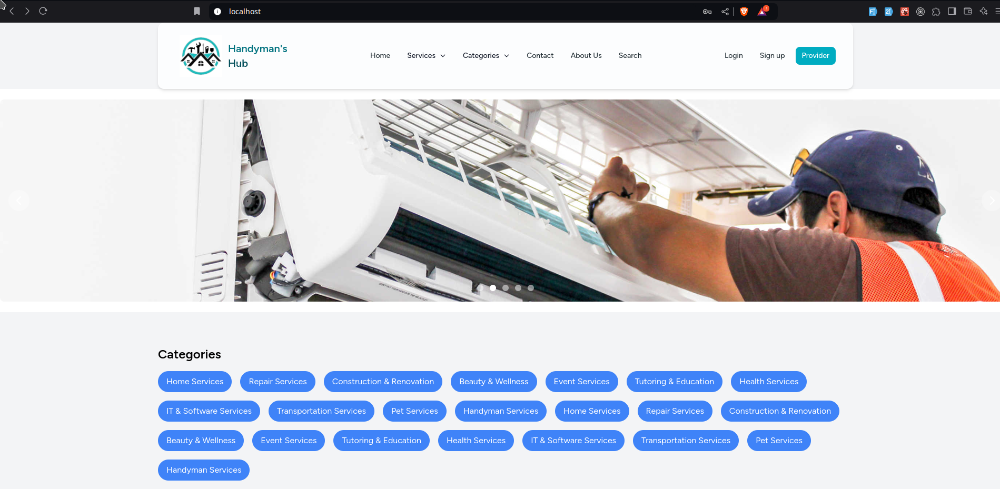
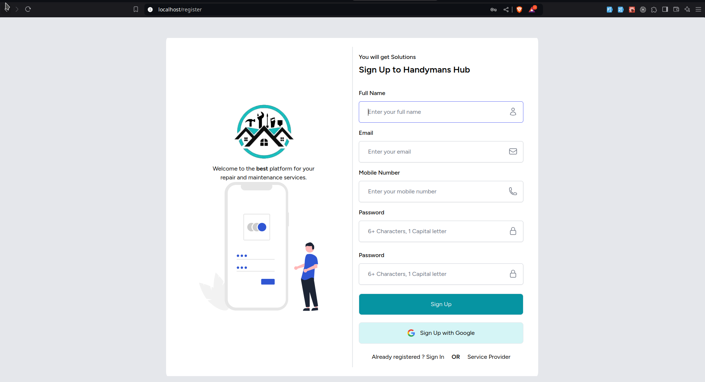
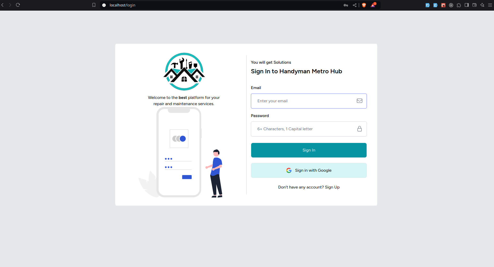

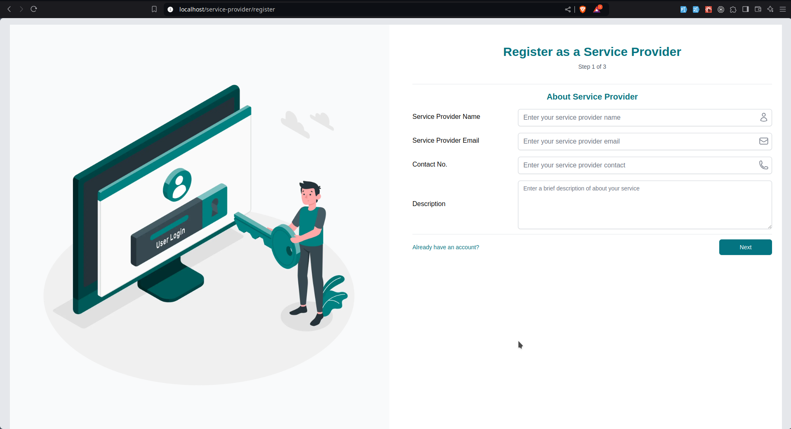
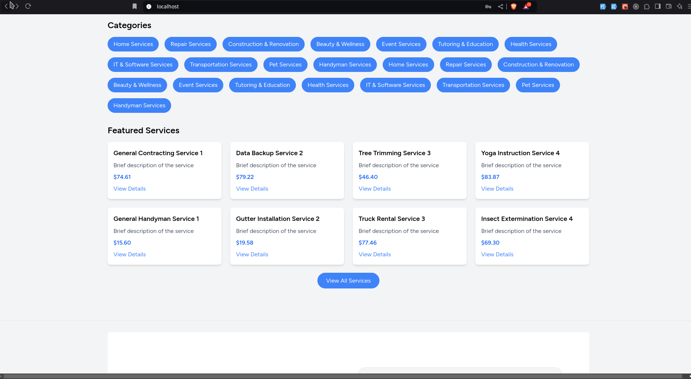
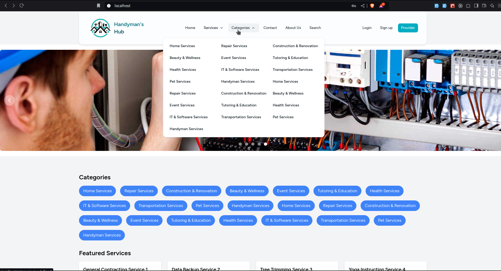
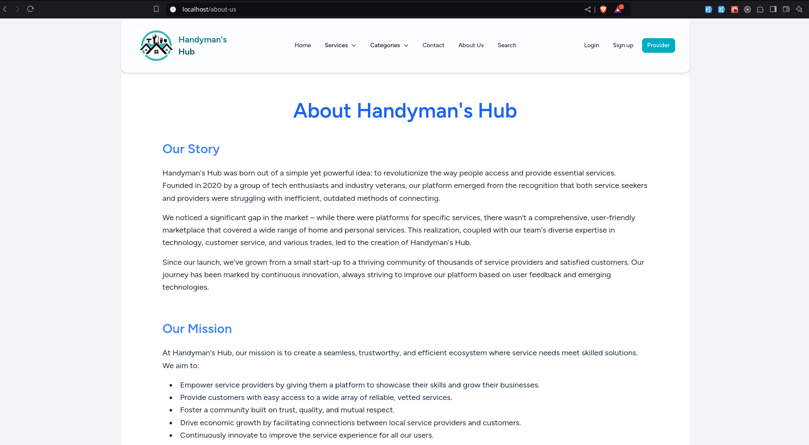

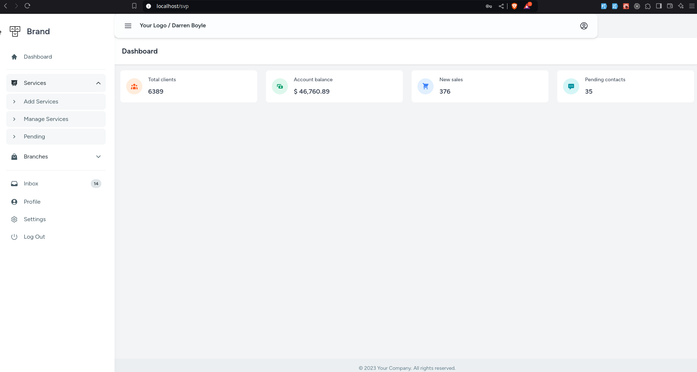
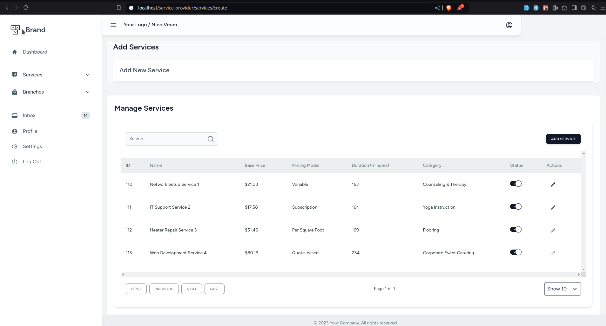
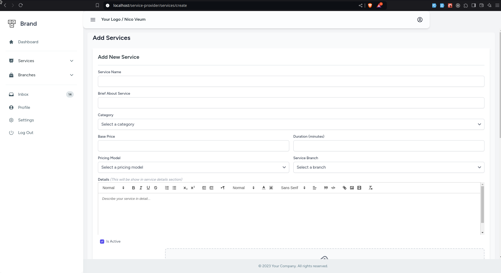
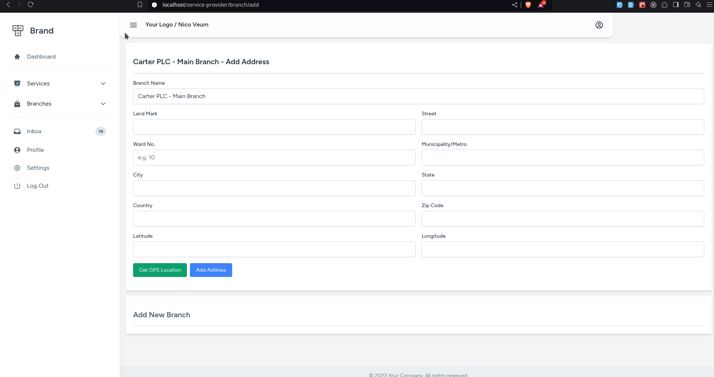
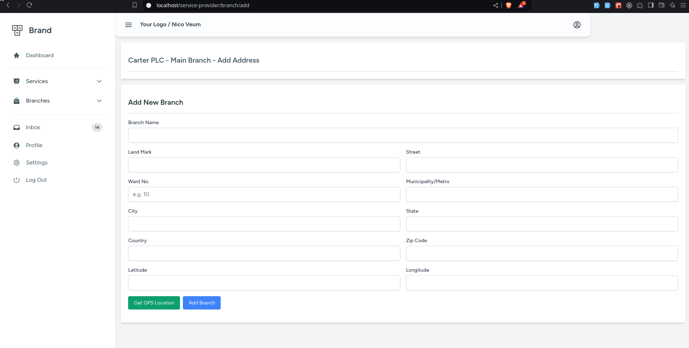
